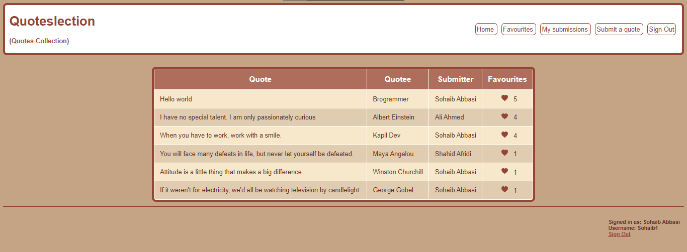

# Quoteslection 🖊 

### Video Demo 📺

(coming soon)

### Description 📄

##### Abstract

Quoteslection, short for quotes-collection, is a website for looking at and sharing quotes. Quotes and information related to them, i.e. Quotee (the one who said the quote), submitter of the quote, and number of favourites can be seen without  signing in. However to use all the features on the site - including features of submitting quotes; liking quotes; and viewing submitted and liked quotes - signing in is required.

##### Folder Structure:

* image/README: contains images for the project readme file
* static: contains static files for the app.
  * static/scripts: JavaScript file(s)
  * static/styles: CSS file(s)
* templates: countains HTML templates for the frontend.
* app.py: The main file, written in python, that runs the application. It contains the backend logic of the application.
* helpers.py: Contains some helper functions that are used by app.py
* requirements.txt: Contains required python dependencies that must be installed to run the application.
* schema.sql: Contains SQL queries for database creation and insertion of some data.

##### Code Details

The application is made using Python's Flask framework, which is a backend web framework. Using flask, python functions for all views or routes are written. A view or a route is something that a user can see / visit. For example one route is called "/" which is the homepage. Another one is "/signup" which can be visited to sign up for a new account. These python functions "listen" for HTTP requests from the front end and respond in different ways. The functions for routes of this application are written in [app.py](app.py), which is explained below:

**app.py**

At the start, required libraries/functions/modules are imported. Next Flask is configured and the database is connected, followed by functions for routes. All functions are decorated by Flask's`@app.route()` which accepts name of route and optionally a list of accepted HTTP request methods. Additionally routes that require user to be logged in have their functions decorated with `@login_required`, the definition of which is in helper.py and it is explained below.

**index** ("/" route)

The default route, for home page. It fetches quotes and details for them from the database and returns the index.html template.

**signup** ("/signup" route)

First this function checks if a user is already signed in, in which case it redirects to the default route. It then checks whether the route was visited via GET parameter in which case it returns the signup.html page. If the page is visited via POST request, that is after submitting signup form, the function first gets the signup details and performs some validation on them. If validation checks aren't passed then  the signup page with an error message is returned. If validation checks are passed then the user is added to the `user` table in the database, signed in via `signin_user` function (present in helpers.py, explained later), and redirected to the default route.

**signin** ("/signin" route)
This works similarly to the signup function. If a user is logged in then a redirect to default route is returned whereas if GET request is recieved then `signin.html` is rendered. If a POST request is recieved (through submitting signin form) then username and password are recieved from the request, and checked if any of them are empty then the `signin.html` page is rendered with an error message. Next the credentials are verified. If they are invalid then the `signin.html` page is rendered with an error message. Otherwise user is signed in via `signin_user` function(present in helpers.py, explained later) and redirected to the default route.

**signout** ("/signout" route)

This function is used to log a currently logged in user out. It first checks if a user is logged in, and if so signs them out via the `signout_user` function present in helpers.py, and then redirects to default route

**my_favourite** ("/my_favourites"

This route corresponds to the my favourites page. The function for this route gets all the quotes and details for the quotes that the user has "favourited" and renders my_favourites.html with those quotes.

**my_submissions** ("/my_submissions")

This route corresponds to the my submissions page. The function for this route gets all the quotes and details for the quotes that the user has submitted and renders my_submissions.html with those quotes.

**submit** ("/submit")

This function is for submitting quotes. If the route is visited via GET request then `submit.html` is simply returned. Otherwise, it must have been visited by a POST request in which case the quote and quotee are fetched from the request form. Next it is checked that they aren't empty, and if any one of them is, then `submit.html` is returned with an error message. If not empty then, it is checked if the quote already exists in the database and if it does then `submit.html` is returned with an error message. If it is a unique quote then it is inserted into the database and `submit.html` is rendered with a success message flash.

**favouriteify_quote** ("/favouriteify_quote" route)

This function isn't for a view, rather it is an API for making a quote favourite on unfavourite it. It first gets the quote_id of the quote to be favourited from the request form and then depending on weather the request form's value for the `is_favourite` variable, it makes the quote for the currently signed in user favourite or unfavourite (makes it favourite if current value of `is_favourite` is False and vice versa).  Next the function gets the current favourite count for the quote and returns it in json format for the frontend to update.

**delete_quote** ("/delete_quote/<quote_id>" route)

This function corresponds to the delete quote page.  It recieves `quote_id` for the quote to delete via the url. If it recieves a GET request then it queries the database for the id, text and quotee of the quote where the id is same as `quote_id`and submitter is the currently signed in user. If no such quote exists then user is redireced to the my submissions route. Otherwise the `delete_quote.html` page is rendered which shows a warning and confirmation for deleting the quote. If the route is visited via POST request then the request's form's value `confirm_delete`is fetched. If its false then a redirect to my_submissions is returned but if it is true then the quote is deleted from the database, followed by a redirect to my_submissions.

**Helpers.py**

This file contains some helper functions for [app.py](app.py) to use. They are as follows:

**login_required**

A decorater function that makes sure that the decorated function cant be visited if visited when not signed in (in which case a redirect for the sign in route is returned.

**signin_user**

This function sign ins a user by remembering them by storing their information in session cookies.

**signout_user**

This function signs out a user by clearing the session.

**valid_password**

This function returns a boolean value depending on whether the input password is valid or not. In this case a password is valid if it has more than 4 characters.

**get_favourites**

This function fetches from database and returns a set of quote_ids of the quotes which are favourited by the currently signed in user

**/templates**

This folder contains html files. They are written using the jinja templating language which is used for writing dynamic web pages.

**/static/scripts**

This folder is for storing javascript files for frontend logic. It only contains 1 file whose task is to favourite or unfavourite a quote. When the heart button is clicked for any quote, this script makes an AJAX call to the backend at the `/favouriteify_quote` URL and updates the favourite count and heart button on the frontend.

**/static/styles**

This folder is for storing CSS files and currently contains only one file.

#### Screenshots

###### Home page (when not signed in)

###### Home page (when signed in)

###### Sorting filter on home page

###### Favourites

###### My Submissions page

###### Delete Quote page (accessed by clicking on delete icon for a quote on My Submissions page

###### Sign Up page

###### Sign In page

### How to run on your computer 💻

###### Prerequisites

* Install Python (Version 3.8 or above)

  * [Python downloads website](httpshttps://www.python.org/downloads/)
* Following python libraries (which can be installed by running `pip install -r requirements.txt` in a terminal while inside the root directory of the  project):

  * mysql-connector-python
  * Flask
  * Flask-Session
* MySQL server (any version should be fine)

  * [MySQL installer download website](https://dev.mysql.com/downloads/mysql/)
* Run the [schema.sql file](schema.sql) (present in root directory of the project) to get the database. Optionally uncomment the insert statements present at the bottom to get some initial data.

###### Run the web app

In a terminal (while in the root of the project), execute `Flask run`. It should give a URL, which you can visit using any browser to view and start using the website.
